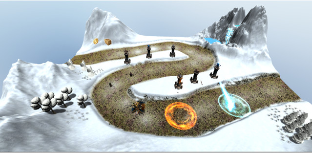

# Final-Project-3D-Game

## 1.	Game world
The game world consists of two levels - two different locations,
The first is the bed of a dried river surrounded by forests [1] [2] and mountains. In the center of the map is a small island. 
On the banks on both sides and on the island, towers [3] can be placed. The path ending with fortress gates [4]. 
After the enemy [5] dies 2 resources collected – coins and crates [6].

 

The second is a winter land [7] surrounded by mountains, trees [8] and a waterfall [9] with a daytime skybox [10]. 
Towers [3] can be placed on the ground which are in the middle of the path. After the enemy [5] dies 2 resources collected – coins and crates [6]. 
There are some magic effects [11] when towers attack enemies. One hero [12] in each level.

  

## 2.	Game characters 

1)	Hero, named Arthur [12] . Armed with a sword and shield,
Attack Power - 10/15/20. We can upgrade hero in main menu from 
Weakness - not able to attack flying units. 

Health – 100 pts.
Wears heavy armor and a shield. Armor – 10. 
We can upgrade hero’s Armor in main menu for +2/+2/+2
 	

 
 

## Towers [3] 
Archer towers. 
Fast attack speed, damage to one enemy per shot. Can attack airborne units.
The damage rate is 10/15/20, depending on the improvement. (The upgrade can be done in main menu, not during the game play) 
Attack Speed – high. 

Cannon Tower 
Slow attack speed, AOE damage to all enemies in the area. Can’t attack flying units.
Damage rate is 5/10/15, depending on the improvement.
Attack Speed – slow.

Magic tower 
shoots enemies with a freezing beam that freezes enemies for 1/2/3 seconds, depending on the improvement. 
Damage Rate - 5.
Attack Speed – medium.

## Enemies [5]: 
### Trolls. 
Type of enemies on the first and second level, have weak armor and weapons, their advantage is quantity.
Impact force - 5/10 /16 depending on the wave (total 3 waves). Weakness - weak armor, are easily destroyed by area damage from the Cannon towers.
Armor on the first level 1/2/3 units depending on the wave. 
Armor on the second level 2/3/4 units depending on the wave.
Health on the first level – 10/20/25 depending on wave;
Health on the second level – 20/25/35 depending on wave;

### Ogres. 
Type of enemies on the second level. Powerful armor, small amount, slow movement speed.
Impact Strength - 15/16/17 depending on the wave (total 3 waves) 
Weakness - slow movement speed.
Armor 3/5/7 units depending on the wave. 
 

## 3.	Grand Story line

After the death of the Old King, he left two sons: the eldest son - Invar and the younger - Arthur.

Power was inherited by the eldest son. At the same time Invar became interested in Black magic and plunged the kingdom of Etheria into the abyss of chaos and poverty.

The youngest son, who was a good warrior, a valiant man, with the help of associates in the castle, was able to seize power and arrest the cruel king. But it was not possible to execute the dark sorcerer, he escaped from custody, using black magic and disappeared into the forests.

For 5 years nothing was heard about him, until recently, rumours reached the castle that gangs of magical creatures began to terrorize the surrounding villages.

3 days ago, the young Arthur received the letter that a large army of trolls had gathered in the southern forests of the kingdom and they were preparing to move north, to the capital. Robbing along the way and killing everyone in their path. The young King decided to personally lead the defence of his lands and moved to the scene of the battle.
The first battle took place in the southern lands, in a gorge formed by the bed of a dried river. The young king, for whom this was the first real battle, got the opportunity to show his force and skills.

But the brave king did not realize that it was nothing but a distraction. Because the main enemy forces, summoned by the disappeared older brother Invar, gathered at the time in the north side of the kingdom. Not far from the capital, to bring down all their cruel power to the main castle of Etheria. 

## 4.	References

Bibliography

[1] 	Shapes, “Nature Starter Kit 2,” 15 01 2016. [Online]. Available: https://assetstore.unity.com/packages/3d/environments/nature-starter-kit-2-52977#description.

[2] 	T. Assets, “Fantasy Forest Environment - Free Demo,” 23 07 2019. [Online]. Available: https://assetstore.unity.com/packages/3d/environments/fantasy/fantasy-forest-environment-free-demo-35361.

[3] 	3DForge, “Tower Defense RTS Human Towers,” 01 11 2019. [Online]. Available: https://assetstore.unity.com/packages/3d/environments/fantasy/tower-defense-rts-human-towers-10817.

[4] 	I. P. Studio, “Polylised - Medieval Desert City,” 03 04 2018. [Online]. Available: https://assetstore.unity.com/packages/3d/environments/historic/polylised-medieval-desert-city-94557.

[5] 	GrigoriyArx, “Fantasy Characters & Creatures pack,” 13 06 2019. [Online]. Available: https://assetstore.unity.com/packages/3d/characters/creatures/fantasy-characters-creatures-pack-65538.

[6] 	Cainos, “Pixel Art Icon Pack - RPG,” 14 12 2019. [Online]. Available: https://assetstore.unity.com/packages/2d/gui/icons/pixel-art-icon-pack-rpg-158343.

[7] 	U. Technologies, “Terrain Tools Sample Asset Pack,” 23 05 2019. [Online]. Available: https://assetstore.unity.com/packages/2d/textures-materials/terrain-tools-sample-asset- pack-145808.

[8] 	W. F. Fun, “Paper Environment Pack vol. 1,” 19 07 2017. [Online]. Available: https://assetstore.unity.com/packages/3d/environments/paper-environment-pack-vol-1-94532.

[9] 	AurynSky, “Forest - Low Poly Toon Battle Arena / Tower Defense Pack,” 27 08 2019. [Online]. Available: https://assetstore.unity.com/packages/3d/environments/forest-low-poly-toon-battle-arena-tower-defense-pack-100080.

[10] 	ProAssets, “Free HDR Sky,” 06 05 2016. [Online]. Available: https://assetstore.unity.com/packages/2d/textures-materials/sky/free-hdr-sky-61217.

[11] 	A. VFX, “Magic Arsenal,” 05 08 2019. [Online]. Available: https://assetstore.unity.com/packages/vfx/particles/spells/magic-arsenal-20869.

[12] 	momomo, “Fantasy Chess RPG Character - Arthur,” 31 01 2020. [Online]. Available: https://assetstore.unity.com/packages/3d/characters/humanoids/fantasy-chess-rpg-character-arthur-160647.

